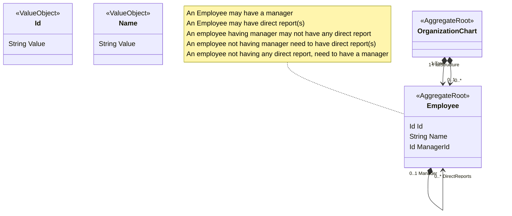
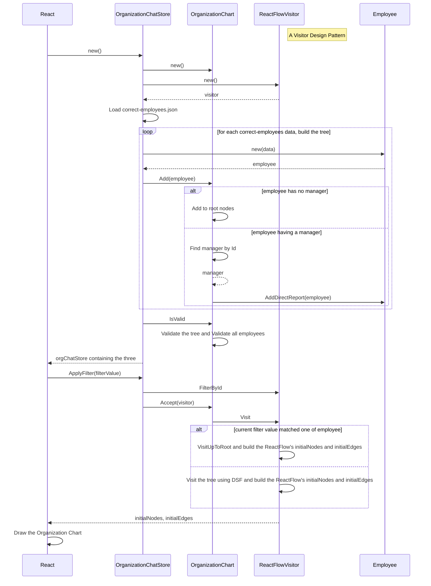

# ECare Test

This is the solution for ECare (company name hidden) Test.


## Domain Models



Build an application storing employees with their tree hierarchy. An employee may have a manager
to report. An employee may have direct report(s). An employee having manager may not have any
direct report. An employee not having manager need to have direct report(s). ~~An employee not
having any direct report, need to have a manager~~ NOTE: This business rule overlaps another rule.

This application should let user to:

1. [x] Search for an employee,
2. [x] Display all his/her managers name up to the root of the tree,
3. [x] Display the total count of his/her direct reports, and
4. [x] Display the total count of his/her indirect reports.

## How It Works



### Example

Please refers to the attached `correct-employees.json` file for employees hierarchy example. The
application should be able to store this employees hierarchy. The end user should be able to search
for an employee and display his/her managers up to the root of the tree. E.g.,

1. [x] When the user searches for “Evelina”, then the application should be able to show “Evelina”,
       and display her managers up to the root of the tree, which are: "Eveleen", "Kacie", and
       "Raelynn".
2. [x] When the user searches for “Martin”, the application should be able to handle it. For
       example, displaying a not found message. (Find other edge cases for bonus points)

   [x] Please also refers to the attached `faulty-employees.json` file for another example. In this hierarchy,
   “Keane” and “Kylee” don’t have any hierarchy. The application should be able to handle it and display
   an error message such as “Unable to process employeee hierarchy. Keane, Kylee not having
   hierarchy”.

   [x] (Find other edge cases for bonus points)
   Another example can be seen from `another-faulty-employees.json` file. In this hierarchy, “Linton”
   has multiple managers. The application should be able to handle it and display an error message
   such as “Unable to process employee tree. Linton has multiple managers: Fletcher, Tabitha”

## Mandatory Specifications

- [x] The application can be written in any OOP based language such as, but not limited to: C#, Java,
      JavaScript, Typescript, C++, python.
- [x] The application can be either frontend or backend, based on your expertise. User interaction
      is also up to you. E.g. It can be a REST API application, or it can be a CLI, or it can be a web app,
      etc. Surprise us.

- [x] The employee hierarchy structure needs to be in a correct Tree structure. Traverse recursively
      instead of iteratively.

- [x] The application needs to store employees in memory (no database).

- [x] The aim of this test is to create the code as elegant, readable, modular, maintainable, and
      testable as possible. This point here is where you should emphasize and showcase your coding
      skill & cleanliness. This is to assess how the candidate writes code in a team environment,
      where the code needs to be well-written to make the code review process smooth.
- [x] Another aim for this test is to check the candidate’s defensive programming skill. The more
      edge cases handled, even if not specified in this document, the better.
- [x] The submitted assignment should include:

  - [x] The code itself
  - [x] Instruction how to build and run the application,
  - [x] Instruction how to run the unit tests (if any),
  - [x] Providing Demo video / screenshots of the application,
  - [x] Unit tests coverage are a plus (optional, helpful).
  - [x] The easier it is for the reviewer to see the application running, the more the submission will stand out.

8. It is up to the candidate how to send this assignment. Sending via email might be blocked by
   the email provider due to security reasons regarding uploading a code file or executable.
   Candidate can share the zip file via google drive (shared link), or the code itself via github
   private repo, or gitlab private repo, etc. You can send an invite for the private repo to my
   github or gitlab account under my same email.

## Optional Specifications - Bonus Points

- [x] Providing unit tests is a plus. More coverage is the better.
- [x] Adding github coverage is a plus.
- [x] Using a docker container is a plus. This can also make it easier for the reviewer to run the application. Which can make the submission stand out more.

## Assessment

- [x] Code originality
- [x] OOP implementation and structure
- [x] Tree structure correctness & its recursive traversal
- [x] Code structure, readability, modularity, maintainability, and testability
- [x] Unit tests coverage (If any)
- [x] Graceful defensive programming on both common cases and unspecified edge cases
- [x] Clarity of documentation. The easier it is for the reviewer to run and test the application, the
      more the submission will stand out.
- [x] Creativity. Surprise us. If the application can be made better, then feel free to upgrade it. As
      long as the application intention is still the same as described above.

## How to Build and Run

Just use this command line:

```
make run
```

Then open browser and visit: `http://localhost:3000`

If it is not againts the rules, I can deploy or create CI/CD that automaticaly deploying to `Vercel`.

## Running the Unit Tests

```
make test
```

## Displaying the Test Coverage

```
make tcoverage
```

## Questionnaire Answers

2024 Questionnaire

1. We work remotely (WFH), but we prefer candidates to able to stay in Java island to make
   accommodation easier. Accomodation such as providing work related peripherals to the
   employee. Would you be able to meet this criteria? **Answer: Of course and would love to!**

2. Our employment is currently a full-time employment (5 days a week, 8 hours per day).
   Would you be able to meet this criteria?
   **Answer: Yes!**

3. There is no gap between our team located in the US and in the Indo. So, are you comfortable
   conversing in English? **Yes, comfortable!**
4. Are you comfortable with Object Oriented Programming? **I consider myself as very passionate in OOP**
5. If you are currently working, why are you finding new job opportunities right now? **I am not currently working**
6. Based on your experience, what software developer level are you in:
   a. Entry,
   b. Mid, or
   c. Senior?
   **I consider myself as a Senior**
7. (Optional, for Senior level) Briefly describe your software design architecture experience &
   accomplishment. **Answer:**
   - **I have experience architecting high load transactions system using Queue and master-slave architecture.**
   - **I have experience designing a mobile app for pregnant moms running in AWS with commentig systems and notifications**
   - **I have experience in architecting and building a web and mobile commerce platform for www.ice.id**
8. (Optional, for non-fresh graduates) Could you briefly describe your usual “a day in your life as
   a software developer”?
   **Answer: A dah in my life starts with my morning Yoga. Then continue to make my breakfast. Then I work on any tasks from Headstarter or building POC for a stock advisor AI that I've been developing. Then in the evening I close my day with another yoga session and then researching on value investing**
9. This recruitment process requires you to do a take home test which might take 8 hours to
   finish, but can be worked on for 2 weeks. Are you willing to continue and do the take home
   test? **Answer: I have done the test**
