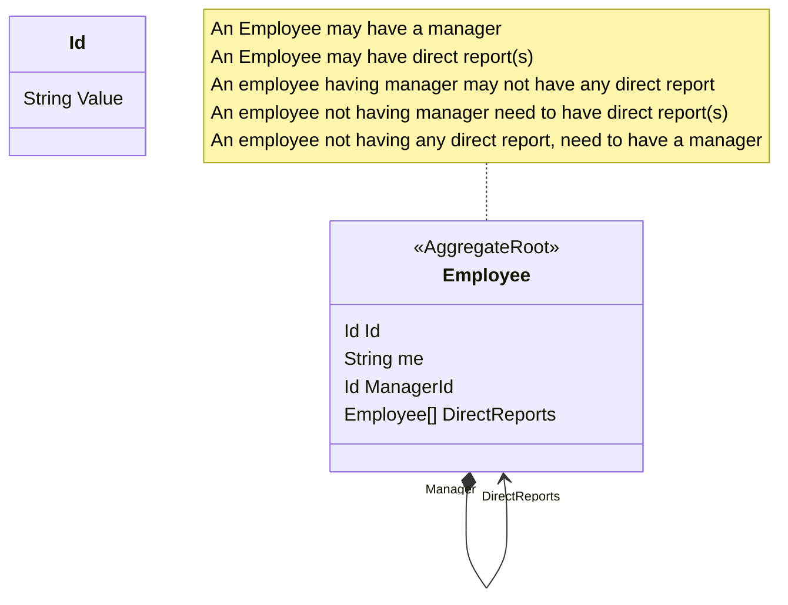

# ECare Test

This is the solution for ECare (company name hidden) Test.

## Domain Models

Build an application storing employees with their tree hierarchy. An employee may have a manager
to report. An employee may have direct report(s). An employee having manager may not have any
direct report. An employee not having manager need to have direct report(s). An employee not
having any direct report, need to have a manager.

This application should let user to:

1. Search for an employee,
2. Display all his/her managers name up to the root of the tree,
3. Display the total count of his/her direct reports, and
4. Display the total count of his/her indirect reports.

### Example

Please refers to the attached `correct-employees.json` file for employees hierarchy example. The
application should be able to store this employees hierarchy. The end user should be able to search
for an employee and display his/her managers up to the root of the tree. E.g.,

1. When the user searches for “Evelina”, then the application should be able to show “Evelina”,
   and display her managers up to the root of the tree, which are: "Eveleen", "Kacie", and
   "Raelynn".
2. When the user searches for “Martin”, the application should be able to handle it. For
   example, displaying a not found message. (Find other edge cases for bonus points)
   Please also refers to the attached `faulty-employees.json` file for another example. In this hierarchy,
   “Keane” and “Kylee” don’t have any hierarchy. The application should be able to handle it and display
   an error message such as “Unable to process employeee hierarchy. Keane, Kylee not having
   hierarchy”
   . (Find other edge cases for bonus points)
   Another example can be seen from `another-faulty-employees.json` file. In this hierarchy, “Linton”
   has multiple managers. The application should be able to handle it and display an error message
   such as “Unable to process employee tree. Linton has multiple managers: Fletcher, Tabitha”

## Mandatory Specifications

- [x] The application can be written in any OOP based language such as, but not limited to: C#, Java,
      JavaScript, Typescript, C++, python.
- [x] The application can be either frontend or backend, based on your expertise. User interaction
      is also up to you. E.g. It can be a REST API application, or it can be a CLI, or it can be a web app,
      etc. Surprise us.

3. The employee hierarchy structure needs to be in a correct Tree structure. Traverse recursively
   instead of iteratively.
4. The application needs to store employees in memory (no database).
5. The aim of this test is to create the code as elegant, readable, modular, maintainable, and
   testable as possible. This point here is where you should emphasize and showcase your coding
   skill & cleanliness. This is to assess how the candidate writes code in a team environment,
   where the code needs to be well-written to make the code review process smooth.
6. Another aim for this test is to check the candidate’s defensive programming skill. The more
   edge cases handled, even if not specified in this document, the better.
7. The submitted assignment should include:
   a. The code itself,
   b. Instruction how to build and run the application,
   c. Instruction how to run the unit tests (if any),
   d. Providing Demo video / screenshots of the application,
   e. Unit tests coverage are a plus (optional, helpful).
   The easier it is for the reviewer to see the application running, the more the submission will
   stand out.
8. It is up to the candidate how to send this assignment. Sending via email might be blocked by
   the email provider due to security reasons regarding uploading a code file or executable.
   Candidate can share the zip file via google drive (shared link), or the code itself via github
   private repo, or gitlab private repo, etc. You can send an invite for the private repo to my
   github or gitlab account under my same email.
